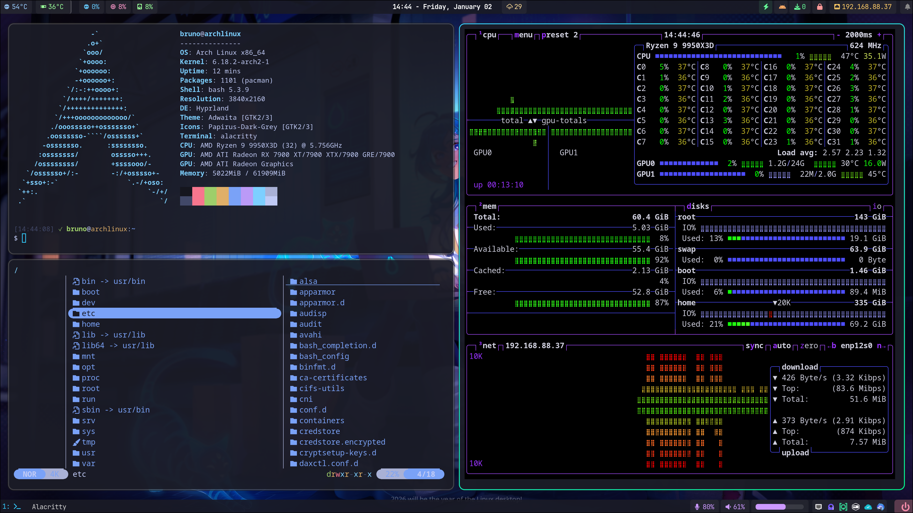

# Arch Linux Dotfiles - Hyprland Setup

Personal dotfiles for Arch Linux with Hyprland window manager.



## Features

- **Window Manager**: Hyprland (Wayland compositor)
- **Session Manager**: UWSM (Universal Wayland Session Manager)
- **Display Manager**: greetd with ReGreet (GTK4 greeter)
- **Status Bar**: Waybar (top + bottom bars) with modular config
- **Terminal**: Alacritty with Tokyo Night theme
- **Notifications**: Mako
- **Lock Screen**: Hyprlock
- **App Launcher**: Rofi
- **Audio**: PipeWire with GTK device selector popups
- **Weather**: wttrbar widget with forecast popup
- **Editor**: Vim with NERDTree, coc.nvim
- **Shell**: Custom colorful PS1 with git branch info

## Installation

### Prerequisites

- **Arch Linux** with base system installed
- **paru** AUR helper (auto-installed if missing)

### Quick Install

```bash
git clone https://github.com/brunobcestari/arch_dotfiles.git ~/arch_dotfiles
cd ~/arch_dotfiles
./install.sh
```

The installer will:
1. Auto-install paru if needed
2. Show essential packages and prompt for optional ones
3. Backup existing configurations
4. Install packages and copy configs
5. Set up greetd display manager
6. **Configure displays** (resolution, refresh rate, positioning)

### Display Configuration

The installer includes an interactive display detection script that runs at the end:

```bash
# Or run it manually anytime:
./scripts/detect-displays.sh
```

Features:
- Auto-detects connected monitors from `/sys/class/drm/`
- Shows available resolutions/refresh rates (if `v4l-utils` is installed)
- Lets you select primary monitor and configure each display
- Asks for left-to-right monitor order and auto-calculates positions
- Generates `hypr/monitors.conf`

### Command-Line Options

```bash
./install.sh --help        # Show help
./install.sh --dry-run     # Preview without making changes
./install.sh --backup-dir ~/my-backups  # Custom backup location
```

### Optional Packages

The installer prompts for these optional categories:

| Category | Packages |
|----------|----------|
| filemanager | Thunar |
| development | Vim, Node.js, npm, git, Waydroid, Podman |
| monitoring | btop |
| hardware | brightnessctl, playerctl, OpenLinkHub, razercfg, v4l-utils |
| customization | workstyle-git |
| personal | ProtonMail, Proton Pass, pCloud, Thunderbird, etc. |

Optional packages are defined in `optional-apps.conf` with the format:
```
category|package-name|description|repo
```
Where `repo` is either `official` (pacman) or `aur`. The installer uses an interactive menu to let you select which packages to install.

## Keybindings

| Key | Action |
|-----|--------|
| `Super + Return` | Terminal (Alacritty) |
| `Super + D` | App launcher (Rofi) |
| `Super + L` | Lock screen |
| `Super + E` | File manager |
| `Super + Shift + Q` | Close window |
| `Super + Shift + E` | Exit Hyprland |
| `Super + 1-9` | Switch workspace |
| `Super + Shift + 1-9` | Move window to workspace |
| `Super + V` | Toggle floating |

## Directory Structure

```
arch_dotfiles/
├── hypr/                  # Hyprland configs (modular)
│   ├── hyprland.conf      # Main config
│   ├── monitors.conf      # Display setup (auto-generated)
│   ├── keybindings.conf   # Keyboard shortcuts
│   └── ...
├── waybar/                # Status bar
│   ├── config-*.jsonc.tpl # Bar configurations
│   ├── modules/           # Module definitions
│   └── scripts/           # Custom scripts
├── scripts/               # Utility scripts
│   └── detect-displays.sh # Display configuration
├── greetd/                # Login manager
├── alacritty/             # Terminal
├── rofi/                  # App launcher
├── mako/                  # Notifications
├── uwsm/                  # Session environment
├── vim/                   # Vim config
├── ps1/                   # Bash prompt
├── backgrounds/           # Wallpapers
├── packages.txt           # Essential packages
├── optional-apps.conf     # Optional packages
├── install.sh             # Installer
└── sync-from-system.sh    # Sync configs back to repo
```

## Syncing Changes

After modifying configs on your system, sync them back to the repo:

```bash
./sync-from-system.sh
```

## Adding New Packages

**Essential packages** - add to `packages.txt`:
```
alacritty
kitty
```

**Optional packages** - add to `optional-apps.conf`:
```
# Format: category|name|description|repo
development|neovim|Neovim editor|official
```

## Adding New Configs

Edit `install.sh` arrays:

```bash
# Config directories (-> ~/.config/)
readonly CONFIG_DIRS=(
    "hypr"
    "neovim"    # Add here
)

# Home files (-> ~/)
readonly HOME_FILES=(
    "vim/vimrc:.vimrc"
    "zsh/zshrc:.zshrc"    # Add here
)
```

## Troubleshooting

**Display manager conflicts:**
```bash
sudo systemctl disable sddm.service  # or gdm, lightdm
sudo systemctl enable greetd.service
```

**Audio popups not appearing:**
- Ensure `python-gobject`, `gtk3`, `gtk-layer-shell` are installed
- Check scripts are executable: `chmod +x ~/.config/waybar/scripts/*.py`

**UWSM issues:**
```bash
journalctl --user -u uwsm-*
```

## Credits

- [Hyprland](https://hyprland.org/)
- [Waybar](https://github.com/Alexays/Waybar)
- [UWSM](https://github.com/Vladimir-csp/uwsm)
- [greetd](https://git.sr.ht/~kennylevinsen/greetd) & [ReGreet](https://github.com/rharish101/ReGreet)

---

**Author**: Bruno
